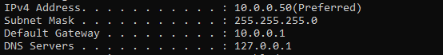
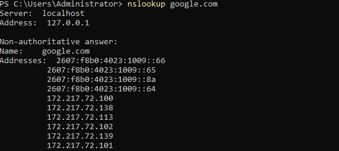
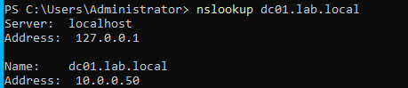
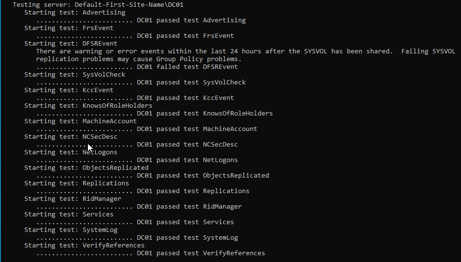
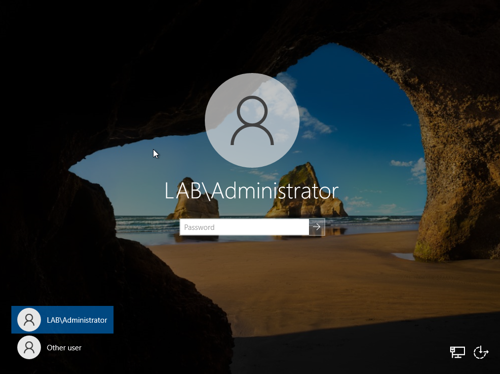
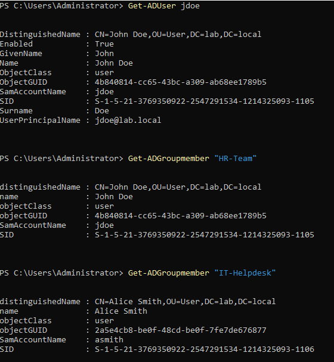
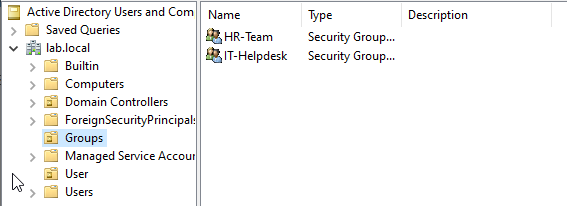
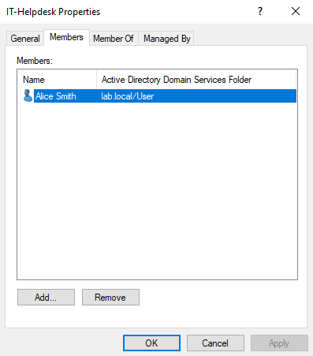
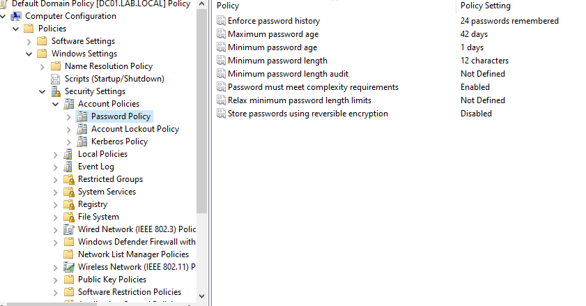

# AD Homelab — Identity & Access Management Build

A self-hosted Active Directory domain controller built from scratch on a home network, designed to practice IAM concepts used in enterprise environments: identity lifecycle, role-based access control (RBAC), DNS architecture, and centralized security policy enforcement.

## Overview

| | |
|---|---|
| **Platform** | Windows Server 2022 (Evaluation), VirtualBox |
| **Networking** | Bridged adapter on home Wi-Fi, static IP, self-referencing DNS |
| **Domain** | `lab.local` (single forest, single domain) |
| **Host** | `DC01` — Domain Controller, DNS Server |

## Architecture

```
Wi-Fi Router (Gateway)
   |
   |  DHCP + external DNS forwarding
   v
DC01 (VM, bridged to Wi-Fi)
   - Static IP on home LAN subnet
   - AD DS + DNS Server roles
   - DNS points to itself (self-referencing)
   v
Host Laptop
   - Runs VirtualBox
   - Same Wi-Fi / same LAN subnet as DC01
```

Bridged networking (rather than NAT) puts the VM directly on the home LAN with its own real IP address, so it behaves like any other device on the network — a requirement for AD DS, since domain members need to reach the DC directly.

## What Was Built

**Network foundation**
- Configured VirtualBox bridged networking over Wi-Fi so the VM receives a real LAN-routable IP
- Assigned a static IP, subnet mask, and gateway matching the home network
- Set DC01's DNS to point to itself, required for AD DS to register and resolve its own service records
- Configured a DNS forwarder so internal (`lab.local`) names resolve locally while external names (e.g. `google.com`) forward out through the router — a split-DNS pattern used in production environments

**Active Directory**
- Installed the AD DS role and promoted DC01 to the first domain controller in a new forest (`lab.local`)
- Verified domain health end-to-end with `dcdiag`

**Identity & access (RBAC)**
- Created custom Organizational Units (`Users`, `Groups`) rather than relying on AD's default containers, to enable Group Policy targeting
- Created security groups representing roles (`HR-Team`, `IT-Helpdesk`)
- Created user identities (`jdoe`, `asmith`) and assigned them to their respective role-based groups — access is granted through group membership, not directly to individual users, following least-privilege / role-based access principles used in real IAM programs

**Security baseline**
- Enforced a domain-wide password policy via Group Policy: 12-character minimum length, complexity requirements enabled

## Verification

All configuration was validated via PowerShell rather than relying solely on the GUI:

```powershell
Import-Module ActiveDirectory

Get-ADUser jdoe
Get-ADGroupMember "HR-Team"
Get-ADGroupMember "IT-Helpdesk"
Get-DnsServerForwarder
dcdiag
```

### Network Configuration

**`ipconfig /all`** — static IP, gateway, and self-referencing DNS


**`nslookup google.com`** — external DNS resolving through the forwarder


**`nslookup dc01.lab.local`** — resolving to a single IPv4 address after the IPv6 fix (see Troubleshooting below)


### Domain Controller Health

**`dcdiag`** — full diagnostic output


**Domain login screen** — `LAB\Administrator`


### Identity & Access (RBAC)

**PowerShell verification** — `Get-ADUser`, `Get-ADGroupMember`


**ADUC** — `Users` and `Groups` OUs


**`Users` OU** — `jdoe`, `asmith`


**`Groups` OU** — `HR-Team`, `IT-Helpdesk`


**HR-Team members** — `jdoe`


**IT-Helpdesk members** — `asmith`


### Security Policy

**Group Policy** — password policy (min length 12, complexity enabled)


## Why This Matters

This build mirrors the identity lifecycle and access governance patterns used in production IAM: centralized authentication, role-based (not per-user) access grants, split DNS, and policy enforced once at the domain level rather than per-machine. It was built independently, outside of assigned work duties, to reinforce architecture-level understanding of how these systems fit together.

## Troubleshooting: DFSREvent Failure (DFSR / IPv6)

During initial `dcdiag` verification, the `DFSREvent` test failed while every other test passed:

```
Starting test: DFSREvent
   There are warning or error events within the last 24 hours after the SYSVOL has been shared.
   Failing SYSVOL replication problems may cause Group Policy problems.
   ......................... DC01 failed test DFSREvent
```

**Diagnosis**

- Checked `Event Viewer → Applications and Services Logs → DFS Replication` and found two errors logged at the time of domain promotion:
  - **Event ID 1202** — DFS Replication service failed to contact a domain controller for configuration information, with the specific sub-error **1355** ("the specified domain either does not exist or could not be contacted").
  - **Event ID 6104** — DFS Replication service failed to register its WMI provider.
- Ran `nslookup dc01.lab.local` and found the DC was resolving to *multiple* addresses — its correct static IPv4 (`10.0.0.50`), plus two public, globally-routable **IPv6** addresses auto-assigned via SLAAC from the home router. Bridged networking puts the VM directly on the LAN with no NAT layer, so IPv6 auto-configuration registered the DC under its real public IPv6 addresses in addition to its intended private IPv4 address.
- Concluded that DFSR was intermittently attempting to reach the DC over IPv6 during its own startup checks, producing the 1355 "domain could not be contacted" error, since IPv6 wasn't an intentional part of this network's design.

**Fix**

- Disabled IPv6 on the DC's network adapter (`Network Connections → Adapter Properties → uncheck Internet Protocol Version 6`).
- Restarted the Netlogon and DFSR services and flushed DNS.
- Confirmed `nslookup dc01.lab.local` now resolves to only the intended static IPv4 address.
- Confirmed via Event Viewer that all DFS Replication events *after* the fix were Information-level (event IDs 1206, 1210, 6102 — successful join, connection, and polling events), with no further warnings or errors.

**Result:** `dcdiag`'s `DFSREvent` test looks back 24 hours, so it continued to report the original startup errors until they aged out of that window — but no new errors occurred after the fix, confirming the root cause was resolved rather than masked.

## Coming Next (Part 2)

- Add a Windows client VM
- Point its DNS at DC01
- Join it to the `lab.local` domain
- Log in as a domain user (`jdoe` / `asmith`) to validate the full identity chain from directory to endpoint

---

*Built as a hands-on lab to strengthen practical Active Directory / IAM skills. Sensitive details (passwords, real IP ranges) have been redacted or generalized in all screenshots.*
---

*Built as a hands-on lab to strengthen practical Active Directory / IAM skills. Sensitive details (passwords, real IP ranges) have been redacted or generalized in all screenshots.*
